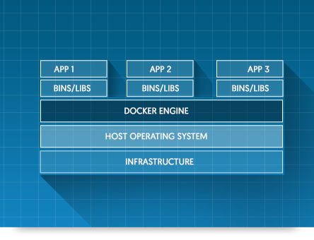

## Docker

* ***Docker*** is an open platform for developing, shipping, and running applications.
* Docker helps you ship code faster, test faster, deploy faster, and shorten the cycle between writing code and running code.
* Docker does this by combining kernel containerization features with workflows and tooling that help you manage and deploy your applications.
* Docker is written in Go.

#### Linux Containers

* Before diving into Docker, let's see what a Linux Container (aka lxc) is.
* ***lxc*** are self-contained execution environments -- with their own, isolated CPU, memory, block I/O, and network resources -- that share the kernel of the host operating system. The result is something that feels like a virtual machine, but sheds all the weight and startup overhead of a guest operating system.
* Linux kernel features viz. *namespaces* and *cgroups* make it possible to have lxc.
* Namespaces deal with resource isolation for a single process, while cgroups manage resources for a group of processes.
* Containers decouple applications from operating systems, which means that users can have a clean and minimal Linux operating system and run everything else in one or more isolated container.
* Also, because the operating system is abstracted away from containers, you can move a container across any Linux server that supports the container runtime environment.

#### Advantages of Docker over lxc

* Both Docker and LXC containers are user-space lightweight virtualization mechanisms that implement cgroups and namespaces to manage resource isolation. There are, however, a number of differences between Docker containers and LXC.

* Docker restricts containers to run as a single process. If your application environment consists of X concurrent processes, Docker wants you to run X containers, each with a distinct process. By contrast, LXC containers have a conventional init process and can run multiple processes.
* The advantages of single-process containers are many, including easy and more granular updates. Why shut down the database process when all you wanted to update is the Web server? Also, single-process containers represent an efficient architecture for building microservices-based applications.
* Docker containers are designed to be stateless, more so than LXC. First, Docker does not support persistent storage. Docker gets around this by allowing you to mount host storage as a “Docker volume” from your containers. Because the volumes are mounted, they are not really part of the container environment.
* Docker containers consist of read-only layers. This means that, once the container image has been created, it does not change.
* *Portability*. Docker abstracts away more networking, storage, and OS details from the application than LXC does. With Docker, the application is truly independent from the configurations of these low-level resources. When you move a Docker container from one Docker host to another Docker-enabled machine, Docker guarantees that the environment for the application will remain the same.

#### Difference between Docker container and VM

* In a large-scale system, running VMs would mean you are probably running many duplicate instances of the same OS and many redundant boot volumes. Because containers are more streamlined and lightweight compared to VMs, you may be able to run six to eight times as many containers as VMs on the same hardware.

* Refer to below images for the architectural difference.

***Credits***
* http://www.infoworld.com/article/3072929/linux/containers-101-linux-containers-and-docker-explained.html
* https://www.docker.com/what-docker
