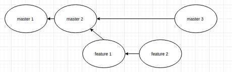
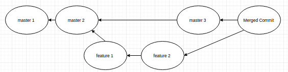
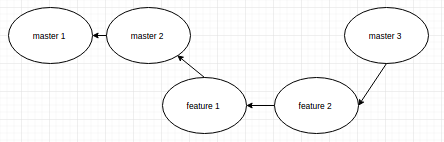

### Branching and Rebase

* Let's create a new repo having a default master branch and a new feature branch.

  `mkdir repo && cd repo`
  `git init`
  `echo "Line 1" >> file1.txt`
  `git add .`
  `git commit -m "master 1"`
  `echo "Line 2" >> file1.txt`
  `git commit -am "master 2"`

  // create a new branch
  `git checkout -b feature`
  `echo "Line 1" >> file-feature.txt`
  `git add .`
  `git commit -m "feature 1"`
  `echo "Line 2" >> file-feature.txt`
  `git commit -am "feature 2"`

  Please note that I am working with a different file in my *feature* branch, so as to avoid any merge conflicts.
  The idea here is to show you what ***git*** does when we do merge/rebase.

  // come back to master branch and take it ahead by one commit
  `git checkout master`
  `echo "Line 3" >> file1.txt`
  `git commit -am "master 3"`

  * So, our repo looks like this currently.

    

    The circles are the commit objects with the commit message on them.

  * Now, we would like to merge the changes done in *feature* branch with the *master*.

  * If we execute following commands, our repo will look like the image below:

    `git checkout master`
    `git merge feature`

    

    Please note that the new *merge commit* is a meta-commit which has no changes of it's own. Also, it has 2 parents.

    Running `git log --graph` will show you both the divergent paths.

    Performing a `git reset HEAD^` that is moving one step back, and then doing a `git log` will only show the master 1, 2 and 3 commits.

  * However, performing a git rebase will give completely different results.

    `git checkout master`
    `git rebase feature`

    The repo will look like a straight line having no commit with 2 parents.

    

* Rebase command is useful when you are working on a local branch and need now to merge your commits with master.

* In my current project, we always work locally on our branch, and when the feature is complete, we do a `git rebase` with squash merge meaning ensuring only single commit is pushed to the master branch.

*
